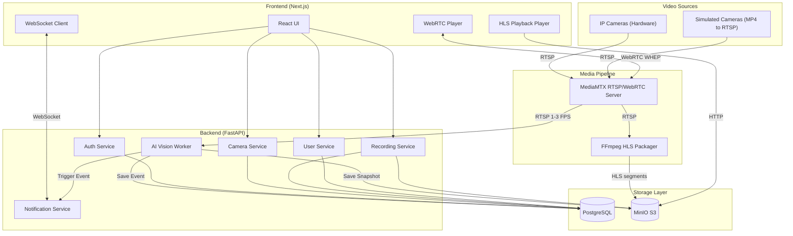
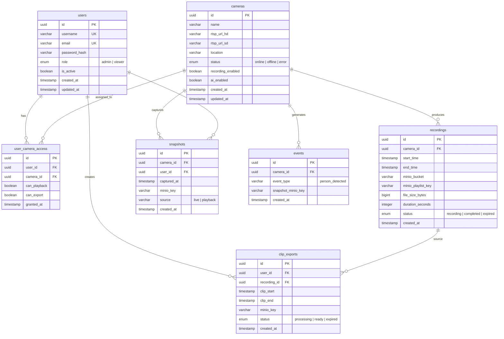
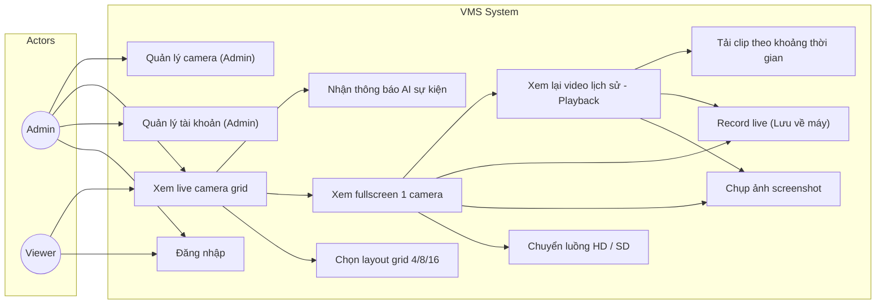
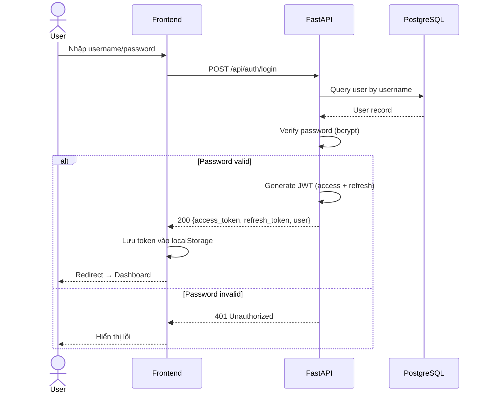
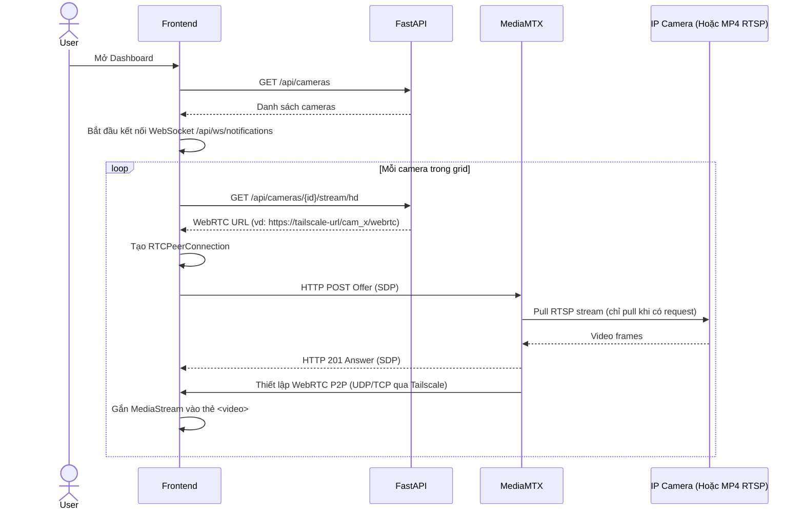
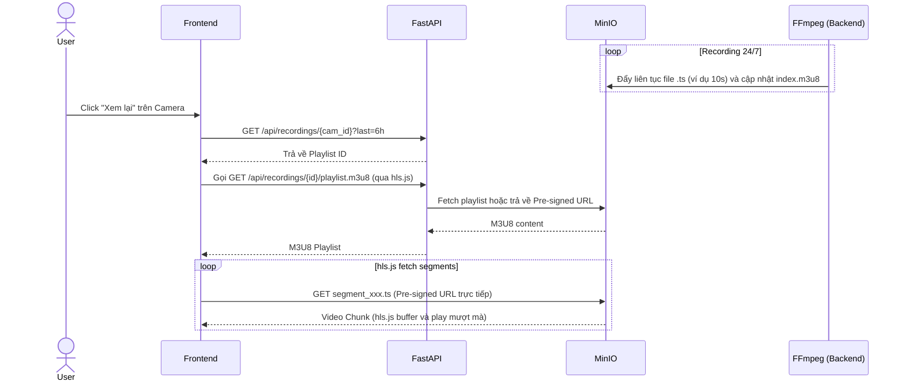
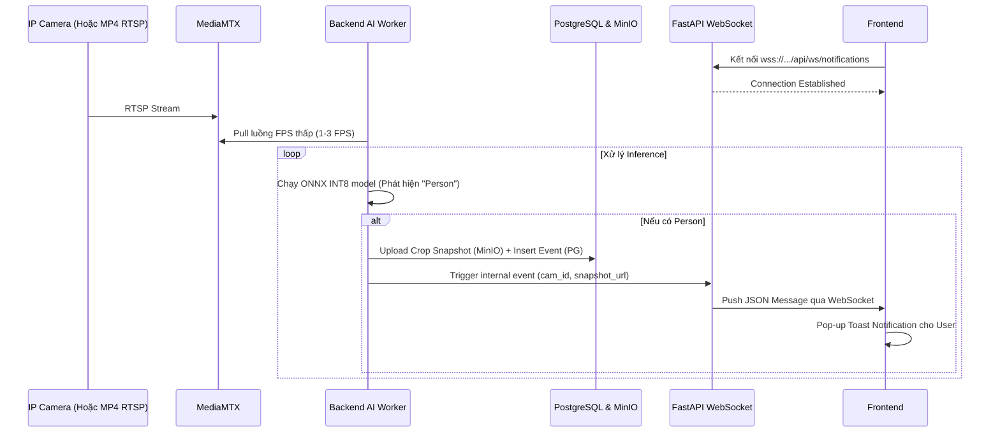
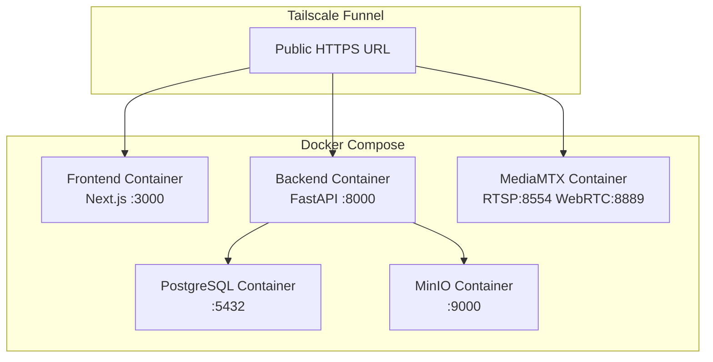

# Video Management System - System Design Document (2 Roles Version)

*Lưu ý: Đây là phiên bản thiết kế hệ thống rút gọn tập trung vào đồ án môn học (BTL), loại bỏ Super Admin, chỉ giữ lại 2 Role là `admin` và `viewer` để tối ưu hóa thời gian triển khai.*

## 1. Tổng quan hệ thống

### 1.1 Mô tả
Hệ thống quản lý camera (VMS) cho phép xem trực tiếp (Low Latency WebRTC), xem lại (HLS Playback), ghi hình và tích hợp AI tự động phát hiện con người từ phía máy chủ với cảnh báo thời gian thực (Real-time Notifications).

### 1.2 Tech Stack
| Layer | Technology |
|-------|-----------|
| Frontend | TypeScript + React (Next.js 16) |
| Backend | Python (FastAPI) + WebSockets |
| Database | PostgreSQL |
| Object Storage | MinIO |
| Streaming | MediaMTX (WebRTC/RTSP) + FFmpeg (HLS) |
| AI Inference | YOLO (ONNX Runtime / TensorRT INT8) - Backend Worker |
| Auth | JWT (access + refresh token) |
| Network | Tailscale Funnel (cho WebRTC/HTTPS) |

---

## 2. System Architecture



### 2.1 Luồng dữ liệu chính

1. **Live Stream**: Camera → RTSP → MediaMTX → WebRTC → Browser Video Player (Độ trễ < 0.5s)
2. **Recording**: Camera → RTSP → MediaMTX → FFmpeg (Tạo HLS `.ts` + `.m3u8`) → MinIO (Lưu trữ 6 tiếng)
3. **Playback**: Browser → Gọi API lấy `playlist.m3u8` → hls.js phát video mượt mà từ MinIO.
4. **AI & Notification**: Backend AI Worker đọc RTSP (1-3 FPS) → Dùng mô hình ONNX INT8 phát hiện người → Lưu DB/MinIO → Báo qua WebSocket → Frontend hiện Toast Alert.

---

## 3. Database Design (PostgreSQL)

### 3.1 ER Diagram



### 3.2 SQL Schema

```sql
-- Enable UUID extension
CREATE EXTENSION IF NOT EXISTS "uuid-ossp";

-- RÚT GỌN CHỈ CÒN 2 ROLE
CREATE TYPE user_role AS ENUM ('admin', 'viewer');
CREATE TYPE camera_status AS ENUM ('online', 'offline', 'error');
CREATE TYPE recording_status AS ENUM ('recording', 'completed', 'expired');
CREATE TYPE export_status AS ENUM ('processing', 'ready', 'expired');
CREATE TYPE event_type_enum AS ENUM ('person_detected', 'camera_offline');

CREATE TABLE users (
    id UUID PRIMARY KEY DEFAULT uuid_generate_v4(),
    username VARCHAR(50) UNIQUE NOT NULL,
    email VARCHAR(100) UNIQUE NOT NULL,
    password_hash VARCHAR(255) NOT NULL,
    role user_role NOT NULL DEFAULT 'viewer',
    is_active BOOLEAN DEFAULT TRUE,
    created_at TIMESTAMPTZ DEFAULT NOW(),
    updated_at TIMESTAMPTZ DEFAULT NOW()
);

CREATE TABLE cameras (
    id UUID PRIMARY KEY DEFAULT uuid_generate_v4(),
    name VARCHAR(100) NOT NULL,
    rtsp_url_hd VARCHAR(500) NOT NULL,
    rtsp_url_sd VARCHAR(500),
    location VARCHAR(200),
    status camera_status DEFAULT 'offline',
    recording_enabled BOOLEAN DEFAULT TRUE,
    ai_enabled BOOLEAN DEFAULT FALSE,
    created_at TIMESTAMPTZ DEFAULT NOW(),
    updated_at TIMESTAMPTZ DEFAULT NOW()
);

CREATE TABLE user_camera_access (
    id UUID PRIMARY KEY DEFAULT uuid_generate_v4(),
    user_id UUID REFERENCES users(id) ON DELETE CASCADE,
    camera_id UUID REFERENCES cameras(id) ON DELETE CASCADE,
    can_playback BOOLEAN DEFAULT TRUE,
    can_export BOOLEAN DEFAULT TRUE,
    granted_at TIMESTAMPTZ DEFAULT NOW(),
    UNIQUE(user_id, camera_id)
);

CREATE TABLE recordings (
    id UUID PRIMARY KEY DEFAULT uuid_generate_v4(),
    camera_id UUID REFERENCES cameras(id) ON DELETE CASCADE,
    start_time TIMESTAMPTZ NOT NULL,
    end_time TIMESTAMPTZ,
    minio_bucket VARCHAR(100) DEFAULT 'recordings',
    minio_playlist_key VARCHAR(500) NOT NULL,
    file_size_bytes BIGINT,
    duration_seconds INTEGER DEFAULT 3600,
    status recording_status DEFAULT 'recording',
    created_at TIMESTAMPTZ DEFAULT NOW()
);

CREATE TABLE events (
    id UUID PRIMARY KEY DEFAULT uuid_generate_v4(),
    camera_id UUID REFERENCES cameras(id) ON DELETE CASCADE,
    event_type event_type_enum NOT NULL,
    snapshot_minio_key VARCHAR(500),
    created_at TIMESTAMPTZ DEFAULT NOW()
);

CREATE TABLE snapshots (
    id UUID PRIMARY KEY DEFAULT uuid_generate_v4(),
    camera_id UUID REFERENCES cameras(id) ON DELETE CASCADE,
    user_id UUID REFERENCES users(id) ON DELETE SET NULL,
    captured_at TIMESTAMPTZ DEFAULT NOW(),
    minio_key VARCHAR(500) NOT NULL,
    source VARCHAR(20) DEFAULT 'live',
    created_at TIMESTAMPTZ DEFAULT NOW()
);

CREATE TABLE clip_exports (
    id UUID PRIMARY KEY DEFAULT uuid_generate_v4(),
    user_id UUID REFERENCES users(id) ON DELETE SET NULL,
    recording_id UUID REFERENCES recordings(id) ON DELETE CASCADE,
    clip_start TIMESTAMPTZ NOT NULL,
    clip_end TIMESTAMPTZ NOT NULL,
    minio_key VARCHAR(500),
    status export_status DEFAULT 'processing',
    created_at TIMESTAMPTZ DEFAULT NOW()
);

-- Indexes
CREATE INDEX idx_recordings_camera_time ON recordings(camera_id, start_time DESC);
CREATE INDEX idx_recordings_status ON recordings(status);
CREATE INDEX idx_events_camera_time ON events(camera_id, created_at DESC);
CREATE INDEX idx_snapshots_camera ON snapshots(camera_id, captured_at DESC);
CREATE INDEX idx_user_camera ON user_camera_access(user_id, camera_id);
```

---

## 4. API Design

### 4.1 Authentication

| Method | Endpoint | Description | Auth |
|--------|----------|-------------|------|
| POST | `/api/auth/login` | Đăng nhập | Public |
| POST | `/api/auth/refresh` | Refresh token | Refresh Token |
| POST | `/api/auth/logout` | Đăng xuất | JWT |
| GET | `/api/auth/me` | Thông tin user hiện tại | JWT |

### 4.2 User Management (Admin Only)

| Method | Endpoint | Description | Auth |
|--------|----------|-------------|------|
| GET | `/api/users` | Danh sách users | Admin |
| POST | `/api/users` | Tạo user mới | Admin |
| PUT | `/api/users/{id}` | Cập nhật user | Admin |
| DELETE | `/api/users/{id}` | Xóa user | Admin |
| PUT | `/api/users/{id}/cameras` | Gán quyền camera cho viewer | Admin |

### 4.3 Camera Management

| Method | Endpoint | Description | Auth |
|--------|----------|-------------|------|
| GET | `/api/cameras` | DS camera user có quyền xem | JWT |
| GET | `/api/cameras/{id}` | Chi tiết camera | JWT |
| POST | `/api/cameras` | Thêm camera mới | Admin |
| PUT | `/api/cameras/{id}` | Sửa cấu hình camera (AI, bật/tắt ghi) | Admin |
| DELETE | `/api/cameras/{id}` | Xóa camera | Admin |
| GET | `/api/cameras/{id}/stream/hd` | WebRTC stream endpoint (HD) | JWT |
| GET | `/api/cameras/{id}/stream/sd` | WebRTC stream endpoint (SD) | JWT |

### 4.4 Recording, Playback & Events

| Method | Endpoint | Description | Auth |
|--------|----------|-------------|------|
| GET | `/api/cameras/{id}/recordings` | DS recordings (6h gần nhất) | JWT |
| GET | `/api/recordings/{id}/playlist.m3u8` | URL HLS Playlist xem lại | JWT |
| POST | `/api/cameras/{id}/clip` | Cắt clip tùy chọn từ lịch sử | JWT |
| GET | `/api/clips/{id}/status` | Trạng thái cắt clip | JWT |
| GET | `/api/clips/{id}/download` | Tải clip đã cắt | JWT |
| GET | `/api/events` | Lấy lịch sử cảnh báo AI | JWT |
| WS | `/api/ws/notifications` | WebSocket nhận thông báo | JWT |

### 4.5 Snapshot

| Method | Endpoint | Description | Auth |
|--------|----------|-------------|------|
| POST | `/api/cameras/{id}/snapshot` | Chụp ảnh (live/playback) | JWT |
| GET | `/api/cameras/{id}/snapshots` | DS ảnh đã chụp | JWT |
| GET | `/api/snapshots/{id}/download` | Tải ảnh | JWT |

### 4.6 Request/Response Examples

```json
// POST /api/auth/login
// Response:
{
  "access_token": "eyJhbG...",
  "refresh_token": "eyJhbG...",
  "token_type": "bearer",
  "user": { "id": "uuid", "username": "admin", "role": "admin" }
}

// GET /api/cameras
// Response:
{
  "cameras": [
    {
      "id": "uuid",
      "name": "Lobby Camera",
      "status": "online",
      "ai_enabled": true,
      "stream_hd": "https://tailscale-url/cam1_hd/webrtc",
      "stream_sd": "https://tailscale-url/cam1_sd/webrtc"
    }
  ]
}

// WS /api/ws/notifications
// Incoming Message (Push từ Backend):
{
  "event_type": "person_detected",
  "camera_id": "uuid",
  "camera_name": "Lobby Camera",
  "timestamp": "2026-05-18T22:00:00Z",
  "snapshot_url": "https://minio-url/bucket/snapshot1.jpg"
}
```

---

## 5. Use Case Diagram



---

## 6. Sequence Diagrams

### 6.1 Đăng nhập



### 6.2 Xem Live Camera (WebRTC Grid)



### 6.3 Ghi hình & Xem lại (HLS Playback)



### 6.4 AI Phát hiện & Thông báo (Backend Worker)



---

## 7. Frontend Component Architecture

```
src/
├── app/
│   ├── layout.tsx              
│   ├── login/page.tsx          
│   ├── dashboard/page.tsx      
│   ├── playback/[id]/page.tsx  
│   └── admin/                  # Giao diện Admin
│       ├── users/page.tsx      
│       └── cameras/page.tsx    
├── components/
│   ├── CameraGrid.tsx          
│   ├── CameraCard.tsx          
│   ├── WebRTCPlayer.tsx        # Xem Live
│   ├── HLSPlayer.tsx           # Xem lại lịch sử 
│   ├── NotificationToast.tsx   # Hiện popup sự kiện AI
│   ├── PlaybackTimeline.tsx    
│   ├── GridLayoutSelector.tsx  
│   └── Pagination.tsx          
├── hooks/
│   ├── useAuth.ts
│   ├── useCamera.ts
│   ├── useWebRTC.ts            
│   └── useNotifications.ts     # Hook quản lý WebSocket
├── lib/
│   ├── api.ts                  
│   └── auth.ts                 
└── types/
    └── index.ts                
```

---

## 8. Backend Project Structure

```
backend/
├── main.py                     
├── config.py                   
├── database.py                 
├── models/                     
│   ├── user.py
│   ├── camera.py
│   ├── recording.py
│   ├── snapshot.py
│   ├── event.py                # Table events
│   └── clip_export.py
├── schemas/                    
├── routers/                    
│   ├── auth.py
│   ├── users.py                # Cần quyền Admin
│   ├── cameras.py              # Cần quyền Admin (để thêm/xóa)
│   ├── recordings.py
│   ├── snapshots.py
│   └── websockets.py           # Endpoints WebSocket
├── services/                   
│   ├── notification_service.py # Quản lý các WS connections
│   └── minio_service.py
├── middleware/
│   └── auth.py                 
├── tasks/
│   ├── recorder.py             
│   ├── cleanup.py              # Dọn dẹp dữ liệu cũ hơn 6h
│   └── ai_worker.py            # Chạy YOLO ONNX
└── requirements.txt
```

---

## 9. AI Pipeline & Recording Pipeline

### 9.1 Quy trình ghi hình HLS (Lưu trữ 6 tiếng)
Thay vì lưu thành từng file lớn `.mp4`, FFmpeg được cấu hình để phân đoạn trực tiếp thành `.ts` (ví dụ 10s) và tạo file `.m3u8` liên tục:
```bash
ffmpeg -i rtsp://localhost:8554/cam1 \
  -c:v copy -an \
  -f hls -hls_time 10 -hls_list_size 0 \
  -hls_segment_filename "minio_path/cam1_%05d.ts" \
  "minio_path/cam1_index.m3u8"
```
**Dung lượng dự kiến (Demo 6 tiếng)**:
- 1 Camera chạy liên tục 6 tiếng (2-5 Mbps) mất khoảng 6 - 12 GB.
- Hệ thống chạy 4 Camera tốn tối đa khoảng **48 GB** trên MinIO. Lịch trình dọn dẹp sẽ tự động xóa các segment cũ.

### 9.2 Tối ưu hóa phần cứng cho AI
- **Phần cứng**: Server triển khai sử dụng GPU **NVIDIA Quadro T2000 Max-Q (4GB VRAM)**.
- **Tối ưu hóa Inference**:
  1. Dùng **ONNX Runtime** kết hợp với **TensorRT Execution Provider** để đẩy nhanh quá trình.
  2. Nén (Quantization) mô hình YOLOv8 từ FP32 xuống **INT8** để giảm dung lượng RAM/VRAM và tăng tốc FPS lên đáng kể, phù hợp với 4GB VRAM.
  3. Lấy mẫu khung hình ở tần số **1 - 3 FPS** (sử dụng `cv2.VideoCapture`), bỏ qua 27 khung hình còn lại trong 1 giây để giảm tải cho CPU/GPU mà vẫn bắt được khoảnh khắc khi có người đi qua.

---

## 10. Deployment Architecture



---

## 11. Kế hoạch triển khai (Sprint Plan)

| Sprint | Thời gian | Nội dung |
|--------|-----------|----------|
| Sprint 1 | Week 1-2 | Database, Models, Auth JWT, User Management |
| Sprint 2 | Week 3-4 | WebRTC Live Streaming, MediaMTX Setup, Camera Management |
| Sprint 3 | Week 5-6 | FFmpeg HLS Recording, MinIO Storage, HLS Playback |
| Sprint 4 | Week 7-8 | Backend AI Worker (ONNX/TensorRT), WebSocket Notifications |
| Sprint 5 | Week 9-10 | Snapshot, Clip Export, Polish, Deploy Tailscale Funnel |
