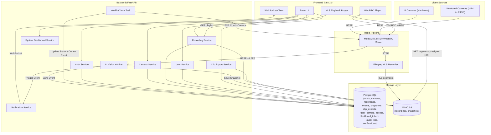
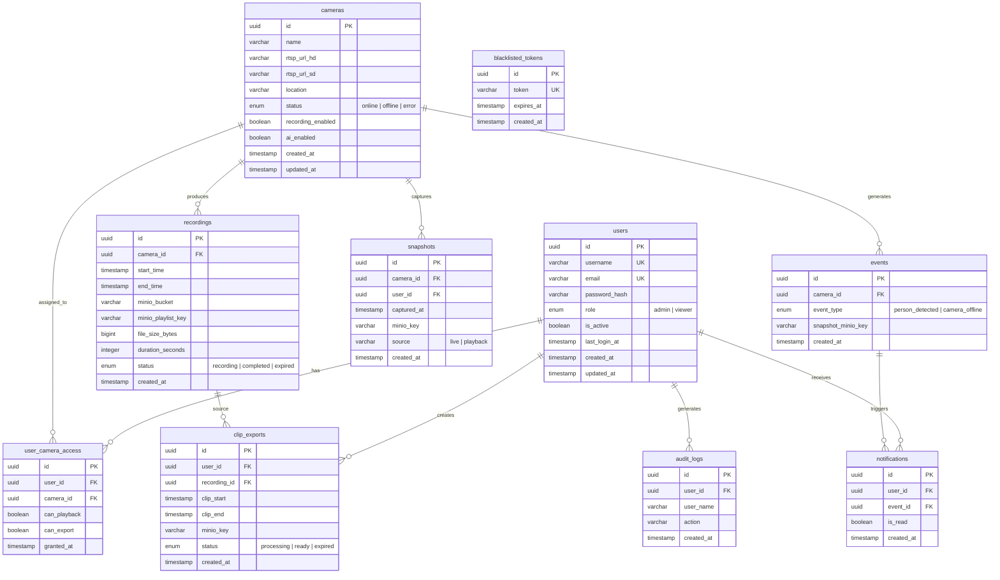
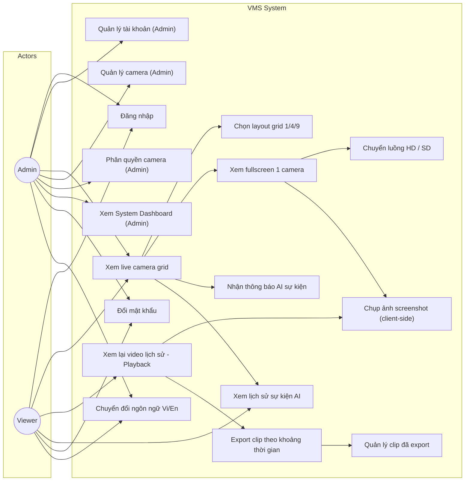
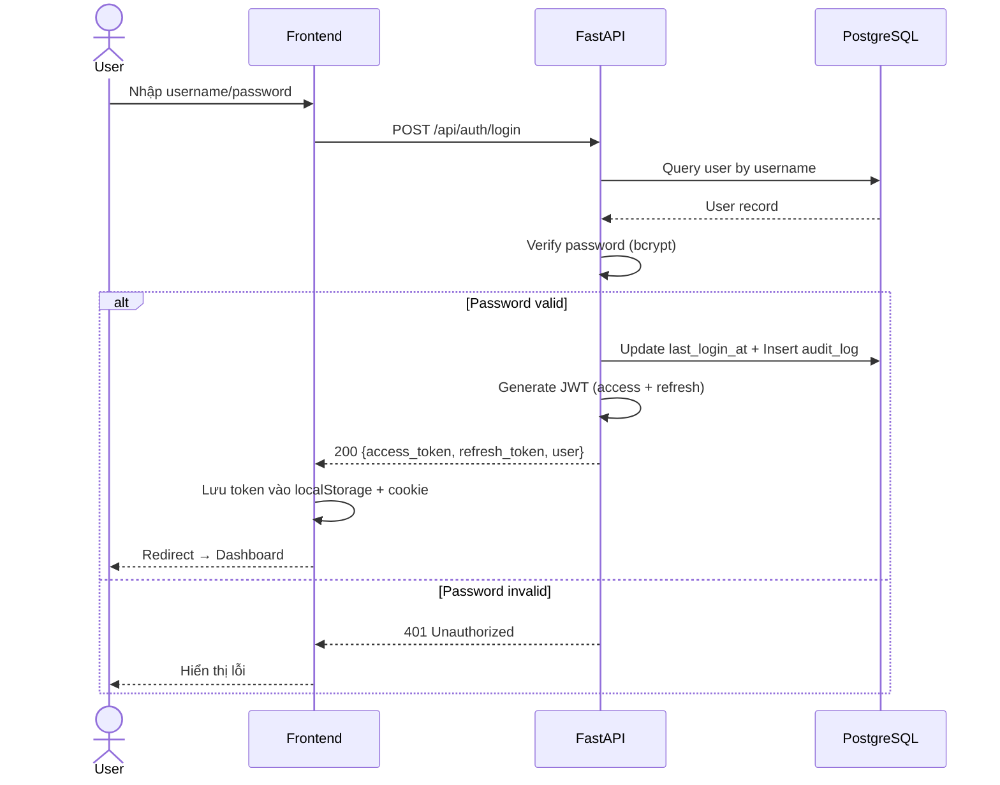
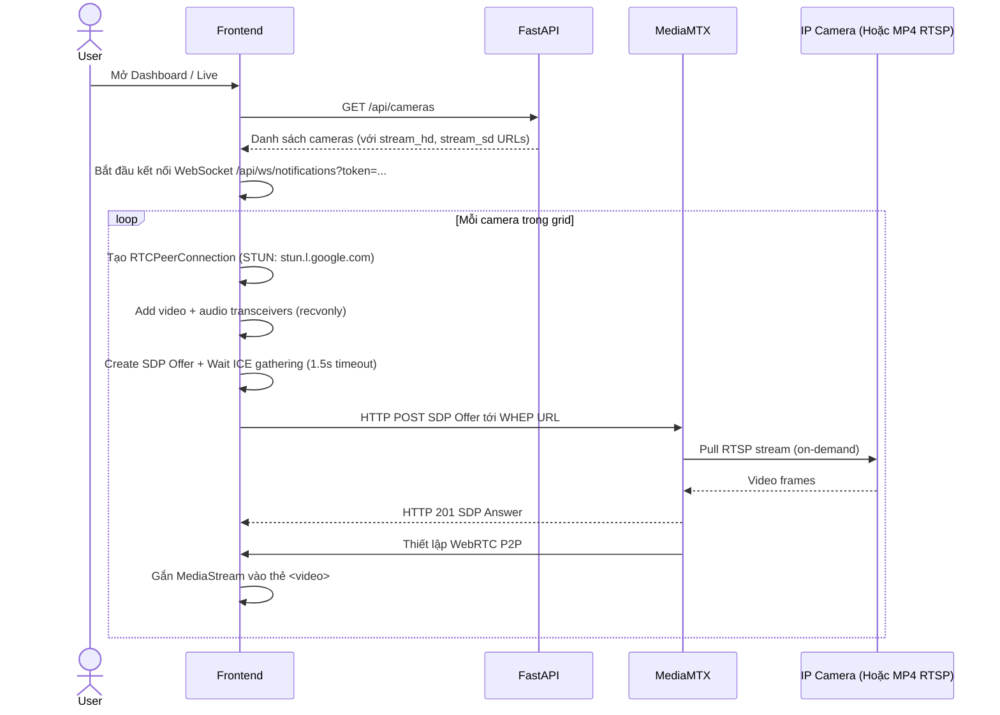
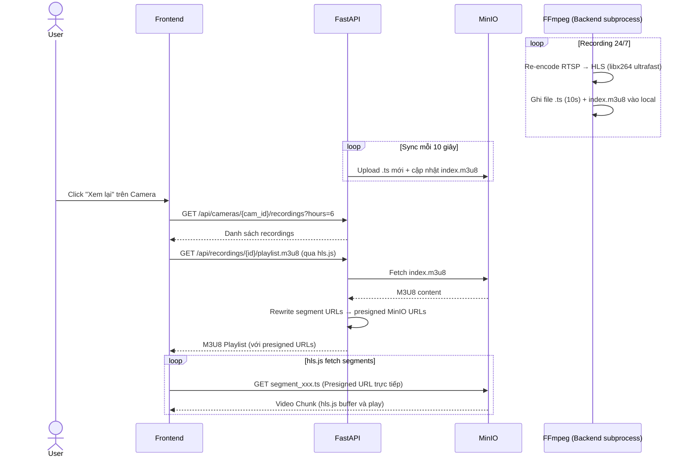
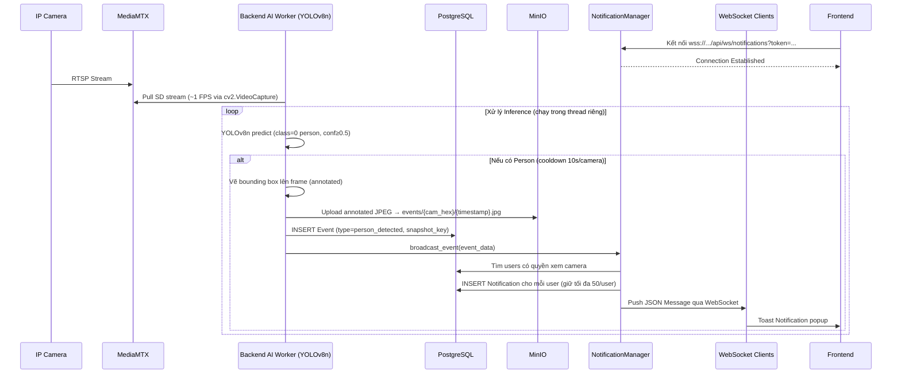
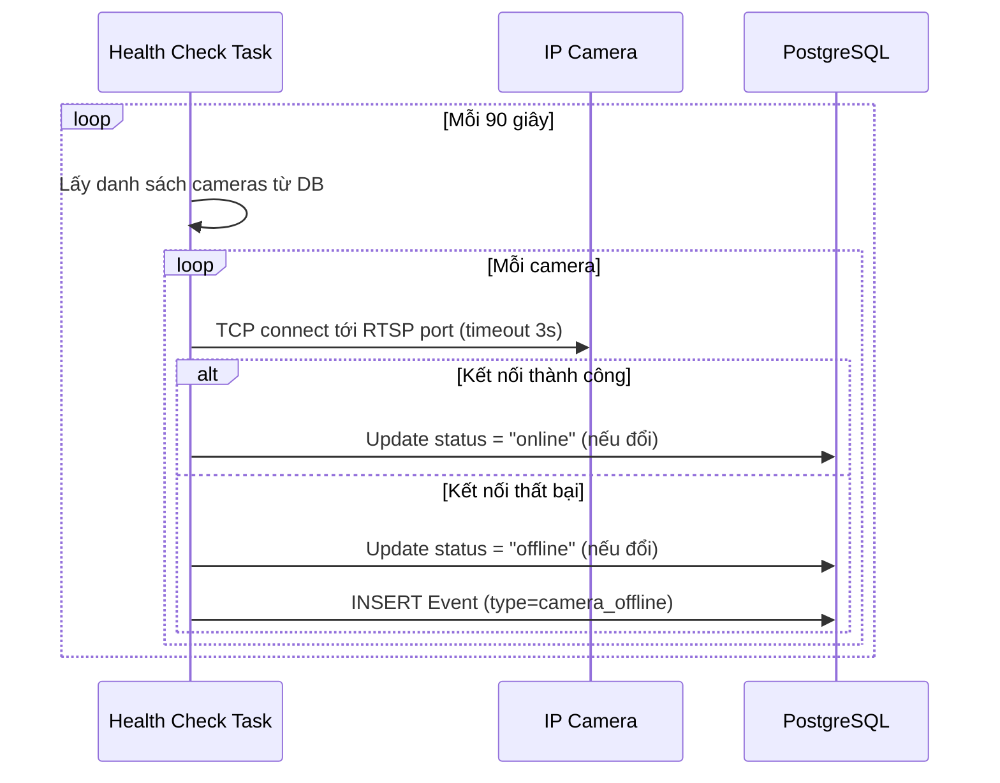
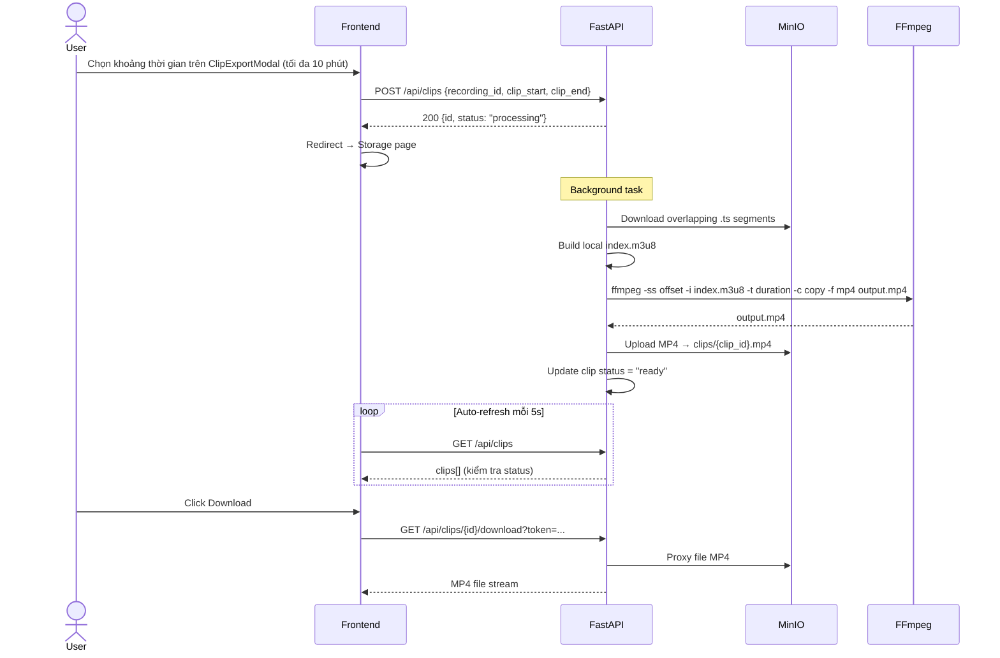
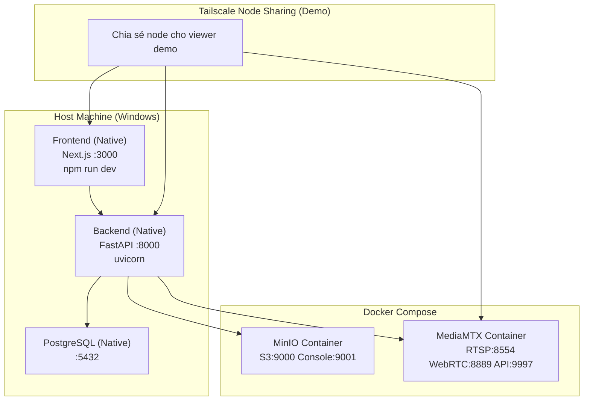

# Video Management System - System Design Document (2 Roles Version)

*Lưu ý: Đây là phiên bản thiết kế hệ thống rút gọn tập trung vào đồ án môn học (BTL), loại bỏ Super Admin, chỉ giữ lại 2 Role là `admin` và `viewer` để tối ưu hóa thời gian triển khai.*

## 1. Tổng quan hệ thống

### 1.1 Mô tả
Hệ thống quản lý camera (VMS) cho phép xem trực tiếp (Low Latency WebRTC), xem lại (HLS Playback), ghi hình và tích hợp AI tự động phát hiện con người từ phía máy chủ với cảnh báo thời gian thực (Real-time Notifications).

### 1.2 Tech Stack
| Layer | Technology |
|-------|-----------|
| Frontend | TypeScript + React (Next.js 16) + Tailwind CSS v4 |
| Backend | Python (FastAPI) + WebSockets |
| Database | PostgreSQL |
| Object Storage | MinIO |
| Streaming | MediaMTX (WebRTC/RTSP) + FFmpeg (HLS) |
| AI Inference | YOLOv8n (ultralytics / PyTorch) - Backend Worker |
| Auth | JWT (access + refresh token) + bcrypt |
| i18n | i18next (Tiếng Việt / English) |
| Network | Tailscale Node Sharing (cho demo) |

---

## 2. System Architecture



### 2.1 Luồng dữ liệu chính

1. **Live Stream**: Camera → RTSP → MediaMTX → WebRTC WHEP → Browser Video Player (Độ trễ < 0.5s)
2. **Recording**: Camera → RTSP → MediaMTX → FFmpeg (re-encode H.264 + Tạo HLS `.ts` + `.m3u8`) → Local temp → Sync MinIO (Lưu trữ 6 tiếng)
3. **Playback**: Browser → Gọi API lấy `playlist.m3u8` (backend rewrite presigned URLs) → hls.js fetch `.ts` segments trực tiếp từ MinIO.
4. **AI & Notification**: Backend AI Worker đọc RTSP SD stream (~1 FPS) → Dùng YOLOv8n phát hiện người (conf ≥ 0.5, cooldown 10s) → Lưu annotated snapshot MinIO + Event DB → Broadcast qua WebSocket + lưu Notification DB → Frontend hiện Toast Alert.
5. **Health Check**: Task kiểm tra TCP connection tới camera mỗi 90s → Cập nhật status camera → Tạo event `camera_offline` nếu mất kết nối.

---

## 3. Database Design (PostgreSQL)

### 3.1 ER Diagram



### 3.2 SQL Schema

```sql
-- Enable UUID extension
CREATE EXTENSION IF NOT EXISTS "uuid-ossp";

-- RÚT GỌN CHỈ CÒN 2 ROLE
CREATE TYPE user_role AS ENUM ('admin', 'viewer');
CREATE TYPE camera_status AS ENUM ('online', 'offline', 'error');
CREATE TYPE recording_status AS ENUM ('recording', 'completed', 'expired');
CREATE TYPE export_status AS ENUM ('processing', 'ready', 'expired');
CREATE TYPE event_type_enum AS ENUM ('person_detected', 'camera_offline');

CREATE TABLE users (
    id UUID PRIMARY KEY DEFAULT uuid_generate_v4(),
    username VARCHAR(50) UNIQUE NOT NULL,
    email VARCHAR(100) UNIQUE NOT NULL,
    password_hash VARCHAR(255) NOT NULL,
    role user_role NOT NULL DEFAULT 'viewer',
    is_active BOOLEAN DEFAULT TRUE,
    last_login_at TIMESTAMPTZ,
    created_at TIMESTAMPTZ DEFAULT NOW(),
    updated_at TIMESTAMPTZ DEFAULT NOW()
);

CREATE TABLE cameras (
    id UUID PRIMARY KEY DEFAULT uuid_generate_v4(),
    name VARCHAR(100) NOT NULL,
    rtsp_url_hd VARCHAR(500) NOT NULL,
    rtsp_url_sd VARCHAR(500),
    location VARCHAR(200),
    status camera_status DEFAULT 'offline',
    recording_enabled BOOLEAN DEFAULT TRUE,
    ai_enabled BOOLEAN DEFAULT FALSE,
    created_at TIMESTAMPTZ DEFAULT NOW(),
    updated_at TIMESTAMPTZ DEFAULT NOW()
);

CREATE TABLE user_camera_access (
    id UUID PRIMARY KEY DEFAULT uuid_generate_v4(),
    user_id UUID REFERENCES users(id) ON DELETE CASCADE,
    camera_id UUID REFERENCES cameras(id) ON DELETE CASCADE,
    can_playback BOOLEAN DEFAULT TRUE,
    can_export BOOLEAN DEFAULT TRUE,
    granted_at TIMESTAMPTZ DEFAULT NOW(),
    UNIQUE(user_id, camera_id)
);

CREATE TABLE recordings (
    id UUID PRIMARY KEY DEFAULT uuid_generate_v4(),
    camera_id UUID REFERENCES cameras(id) ON DELETE CASCADE,
    start_time TIMESTAMPTZ NOT NULL,
    end_time TIMESTAMPTZ,
    minio_bucket VARCHAR(100) DEFAULT 'recordings',
    minio_playlist_key VARCHAR(500) NOT NULL,
    file_size_bytes BIGINT,
    duration_seconds INTEGER DEFAULT 3600,
    status recording_status DEFAULT 'recording',
    created_at TIMESTAMPTZ DEFAULT NOW()
);

CREATE TABLE events (
    id UUID PRIMARY KEY DEFAULT uuid_generate_v4(),
    camera_id UUID REFERENCES cameras(id) ON DELETE CASCADE,
    event_type event_type_enum NOT NULL,
    snapshot_minio_key VARCHAR(500),
    created_at TIMESTAMPTZ DEFAULT NOW()
);

CREATE TABLE snapshots (
    id UUID PRIMARY KEY DEFAULT uuid_generate_v4(),
    camera_id UUID REFERENCES cameras(id) ON DELETE CASCADE,
    user_id UUID REFERENCES users(id) ON DELETE SET NULL,
    captured_at TIMESTAMPTZ DEFAULT NOW(),
    minio_key VARCHAR(500) NOT NULL,
    source VARCHAR(20) DEFAULT 'live',
    created_at TIMESTAMPTZ DEFAULT NOW()
);

CREATE TABLE clip_exports (
    id UUID PRIMARY KEY DEFAULT uuid_generate_v4(),
    user_id UUID REFERENCES users(id) ON DELETE SET NULL,
    recording_id UUID REFERENCES recordings(id) ON DELETE CASCADE,
    clip_start TIMESTAMPTZ NOT NULL,
    clip_end TIMESTAMPTZ NOT NULL,
    minio_key VARCHAR(500),
    status export_status DEFAULT 'processing',
    created_at TIMESTAMPTZ DEFAULT NOW()
);

CREATE TABLE blacklisted_tokens (
    id UUID PRIMARY KEY DEFAULT uuid_generate_v4(),
    token VARCHAR(500) UNIQUE NOT NULL,
    expires_at TIMESTAMPTZ NOT NULL,
    created_at TIMESTAMPTZ DEFAULT NOW()
);

CREATE TABLE audit_logs (
    id UUID PRIMARY KEY DEFAULT uuid_generate_v4(),
    user_id UUID REFERENCES users(id) ON DELETE SET NULL,
    user_name VARCHAR(50),
    action VARCHAR(255) NOT NULL,
    created_at TIMESTAMPTZ DEFAULT NOW()
);

CREATE TABLE notifications (
    id UUID PRIMARY KEY DEFAULT uuid_generate_v4(),
    user_id UUID REFERENCES users(id) ON DELETE CASCADE,
    event_id UUID REFERENCES events(id) ON DELETE CASCADE,
    is_read BOOLEAN DEFAULT FALSE,
    created_at TIMESTAMPTZ DEFAULT NOW()
);

-- Indexes
CREATE INDEX idx_recordings_camera_time ON recordings(camera_id, start_time DESC);
CREATE INDEX idx_recordings_status ON recordings(status);
CREATE INDEX idx_events_camera_time ON events(camera_id, created_at DESC);
CREATE INDEX idx_snapshots_camera ON snapshots(camera_id, captured_at DESC);
CREATE INDEX idx_user_camera ON user_camera_access(user_id, camera_id);
CREATE INDEX idx_blacklisted_token ON blacklisted_tokens(token);
CREATE INDEX idx_notifications_user_id ON notifications(user_id);
```

---

## 4. API Design

### 4.1 Authentication

| Method | Endpoint | Description | Auth |
|--------|----------|-------------|------|
| POST | `/api/auth/login` | Đăng nhập | Public |
| POST | `/api/auth/refresh` | Refresh token | Refresh Token |
| POST | `/api/auth/logout` | Đăng xuất (blacklist token) | JWT |
| GET | `/api/auth/me` | Thông tin user hiện tại | JWT |
| POST | `/api/auth/change-password` | Đổi mật khẩu | JWT |

### 4.2 User Management (Admin Only)

| Method | Endpoint | Description | Auth |
|--------|----------|-------------|------|
| GET | `/api/users` | Danh sách users (pagination, search) | Admin |
| POST | `/api/users` | Tạo user mới | Admin |
| GET | `/api/users/{id}` | Chi tiết user + camera access | Admin |
| PUT | `/api/users/{id}` | Cập nhật user | Admin |
| DELETE | `/api/users/{id}` | Xóa user (không tự xóa) | Admin |
| PUT | `/api/users/{id}/cameras` | Gán/thay thế quyền camera cho viewer | Admin |

### 4.3 Camera Management

| Method | Endpoint | Description | Auth |
|--------|----------|-------------|------|
| GET | `/api/cameras` | DS camera user có quyền xem (pagination, search) | JWT |
| GET | `/api/cameras/{id}` | Chi tiết camera | JWT |
| POST | `/api/cameras` | Thêm camera mới (validate RTSP via OpenCV) | Admin |
| PUT | `/api/cameras/{id}` | Sửa cấu hình camera (AI, bật/tắt ghi) | Admin |
| DELETE | `/api/cameras/{id}` | Xóa camera + dọn MediaMTX/MinIO/local | Admin |
| GET | `/api/cameras/{id}/stream/hd` | WebRTC WHEP URL (HD) | JWT |
| GET | `/api/cameras/{id}/stream/sd` | WebRTC WHEP URL (SD) | JWT |

### 4.4 Recording & Playback

| Method | Endpoint | Description | Auth |
|--------|----------|-------------|------|
| GET | `/api/cameras/{id}/recordings` | DS recordings (mặc định 6h gần nhất, dùng overlap filter) | JWT |
| GET | `/api/recordings/{id}/playlist.m3u8` | HLS Playlist xem lại (rewrite segment URLs → presigned MinIO URLs) | JWT |
| GET | `/api/recordings/{id}/segments/{name}` | Proxy 1 segment `.ts` từ MinIO (fallback nếu presigned URL gặp CORS) | JWT |
| POST | `/api/cameras/{id}/recording/start` | Bắt đầu ghi hình thủ công cho 1 camera | Admin |
| POST | `/api/cameras/{id}/recording/stop` | Dừng ghi hình thủ công | Admin |
| GET | `/api/recordings/status` | Trạng thái recording manager (đang ghi bao nhiêu camera) | Admin |

### 4.5 Events & Notifications

| Method | Endpoint | Description | Auth |
|--------|----------|-------------|------|
| GET | `/api/events` | Lấy lịch sử sự kiện AI (RBAC filter, time/type filter) | JWT |
| DELETE | `/api/events/{id}` | Xóa event + dọn snapshot MinIO | JWT |
| WS | `/api/ws/notifications` | WebSocket nhận thông báo real-time (JWT qua query `?token=`) | JWT |
| GET | `/api/notifications` | Danh sách thông báo của user (tối đa 50) | JWT |
| PUT | `/api/notifications/read-all` | Đánh dấu tất cả đã đọc | JWT |
| PUT | `/api/notifications/{id}/read` | Đánh dấu 1 thông báo đã đọc | JWT |

### 4.6 Clip Export

| Method | Endpoint | Description | Auth |
|--------|----------|-------------|------|
| GET | `/api/clips` | DS clip đã export (admin=all, viewer=own) | JWT |
| POST | `/api/clips` | Tạo clip export (background FFmpeg, tối đa 10 phút) | JWT (cần quyền export) |
| DELETE | `/api/clips/{id}` | Xóa clip (owner hoặc admin) | JWT |
| GET | `/api/clips/{id}/download` | Proxy tải clip từ MinIO | JWT (header hoặc query token) |

### 4.7 System Dashboard (Admin Only)

| Method | Endpoint | Description | Auth |
|--------|----------|-------------|------|
| GET | `/api/system/active-sessions` | Users đang kết nối WebSocket | Admin |
| GET | `/api/system/audit-logs` | Lịch sử hành động (time filter) | Admin |
| GET | `/api/system/device-events` | Sự kiện thiết bị (time filter) | Admin |

### 4.8 Request/Response Examples

```json
// POST /api/auth/login
// Response:
{
  "access_token": "eyJhbG...",
  "refresh_token": "eyJhbG...",
  "token_type": "bearer",
  "user": { "id": "uuid", "username": "admin", "role": "admin" }
}

// GET /api/cameras
// Response:
{
  "cameras": [
    {
      "id": "uuid",
      "name": "Lobby Camera",
      "status": "online",
      "recording_enabled": true,
      "ai_enabled": true,
      "stream_hd": "http://localhost:8889/cam_aaa111222_hd_264/whep",
      "stream_sd": "http://localhost:8889/cam_aaa111222_sd_264/whep"
    }
  ],
  "total": 1
}

// GET /api/cameras/{id}/recordings?hours=3
// Response (overlap filter: end_time > cutoff OR end_time IS NULL):
{
  "recordings": [
    {
      "id": "rec-uuid-4",
      "camera_id": "cam-uuid",
      "start_time": "2026-05-22T10:00:00Z",
      "end_time": null,
      "duration_seconds": null,
      "status": "recording",
      "minio_playlist_key": "cam-uuid/2026-05-22_10-00/index.m3u8"
    },
    {
      "id": "rec-uuid-3",
      "camera_id": "cam-uuid",
      "start_time": "2026-05-22T09:00:00Z",
      "end_time": "2026-05-22T10:00:00Z",
      "duration_seconds": 3600,
      "status": "completed",
      "minio_playlist_key": "cam-uuid/2026-05-22_09-00/index.m3u8"
    }
  ],
  "total": 2
}

// GET /api/recordings/{id}/playlist.m3u8
// Response (application/vnd.apple.mpegurl):
// Backend đọc index.m3u8 từ MinIO, rewrite segment URLs → presigned URLs:
// #EXTM3U
// #EXT-X-VERSION:3
// #EXT-X-TARGETDURATION:10
// #EXTINF:10.000,
// http://localhost:9000/recordings/.../seg_00000.ts?X-Amz-Signature=abc...
// #EXTINF:10.000,
// http://localhost:9000/recordings/.../seg_00001.ts?X-Amz-Signature=def...

// WS /api/ws/notifications?token=eyJhbG...
// Incoming Message (Push từ Backend):
{
  "event_type": "person_detected",
  "camera_id": "uuid",
  "camera_name": "Lobby Camera",
  "timestamp": "2026-05-18T22:00:00Z",
  "snapshot_url": "https://minio-url/snapshots/events/cam_hex/timestamp.jpg"
}

// POST /api/clips
// Request:
{
  "recording_id": "rec-uuid",
  "clip_start": "2026-05-22T09:15:00Z",
  "clip_end": "2026-05-22T09:20:00Z"
}
// Response:
{
  "id": "clip-uuid",
  "recording_id": "rec-uuid",
  "camera_name": "Lobby Camera",
  "clip_start": "2026-05-22T09:15:00Z",
  "clip_end": "2026-05-22T09:20:00Z",
  "status": "processing",
  "created_at": "2026-05-22T10:00:00Z"
}
```

---

## 5. Use Case Diagram



---

## 6. Sequence Diagrams

### 6.1 Đăng nhập



### 6.2 Xem Live Camera (WebRTC Grid)



### 6.3 Ghi hình & Xem lại (HLS Playback)



### 6.4 AI Phát hiện & Thông báo (Backend Worker)



### 6.5 Health Check & Camera Offline Detection



### 6.6 Clip Export



---

## 7. Frontend Component Architecture

```
src/
├── app/
│   ├── globals.css                # Tailwind v4 @theme + Material Design 3 tokens
│   ├── layout.tsx                 # Root layout: AuthProvider, Be Vietnam Pro font
│   ├── page.tsx                   # "/" → redirect to /dashboard
│   ├── login/
│   │   ├── layout.tsx             # Center-aligned wrapper
│   │   └── page.tsx               # Login page (AuthBanner + LoginForm)
│   └── dashboard/
│       ├── layout.tsx             # Dashboard shell: Sidebar + Header + NotificationToastManager
│       ├── page.tsx               # Conditional: AdminHomePage / UserHomePage
│       ├── live/page.tsx          # Live camera grid (WebRTC)
│       ├── playback/page.tsx      # HLS playback + Timeline + ClipExportModal
│       ├── events/page.tsx        # AI event gallery (person_detected)
│       ├── storage/page.tsx       # Quản lý clip đã export
│       ├── settings/page.tsx      # Đổi ngôn ngữ + Đổi mật khẩu
│       └── admin/
│           ├── layout.tsx         # Admin guard + AdminTabNav
│           ├── users/page.tsx     # CRUD quản lý user
│           ├── cameras/page.tsx   # CRUD quản lý camera
│           └── access/page.tsx    # Phân quyền camera per viewer
├── assets/
│   ├── hero-dashboard-preview.png
│   ├── logo-camai.png
│   └── offline_camera.webp
├── components/
│   ├── NotificationToastManager.tsx   # WebSocket-driven toast (max 3, auto-dismiss 5s)
│   ├── auth/
│   │   ├── AuthBanner.tsx             # Dark hero banner (login page left panel)
│   │   └── LoginForm.tsx              # Login form
│   ├── camera/
│   │   ├── ClipExportModal.tsx        # Draggable range slider, max 10 min
│   │   ├── GridLayoutSelector.tsx     # Toggle layout 1/4/9
│   │   ├── HLSPlayer.tsx             # hls.js player + Bearer token injection
│   │   ├── Timeline.tsx              # 6-hour recording timeline, click-to-seek
│   │   └── WebRTCPlayer.tsx           # WHEP-based WebRTC player
│   ├── dashboard/
│   │   ├── AdminHomePage.tsx          # Active sessions, audit logs, device events
│   │   └── UserHomePage.tsx           # Recent AI events + camera list
│   ├── layout/
│   │   ├── AdminTabNav.tsx            # Tab nav: Users/Cameras/Access
│   │   ├── AuthFooter.tsx             # Login footer
│   │   ├── DashboardHeader.tsx        # Header: notifications, language, profile
│   │   └── DashboardSidebar.tsx       # Left sidebar navigation (role-filtered)
│   └── ui/
│       ├── Badge.tsx, Button.tsx, EmptyState.tsx
│       ├── Modal.tsx, Pagination.tsx
│       ├── SearchInput.tsx, Table.tsx
├── hooks/
│   ├── useAuth.tsx                # AuthContext + Provider, login/logout/verify
│   ├── useCamera.ts               # Camera CRUD + stream URLs
│   ├── useNotifications.ts        # WebSocket + REST notifications
│   ├── useRecording.ts            # Fetch recordings by camera
│   ├── useUsers.ts                # User CRUD + camera permission assignment
│   └── useWebRTC.ts               # WebRTC WHEP connection management
├── lib/
│   ├── api.ts                     # Fetch wrapper + auto token refresh
│   ├── auth.ts                    # localStorage token/user helpers
│   └── i18n.ts                    # i18next config (Vi/En, browser detection)
├── locales/
│   ├── en.json                    # English translations
│   └── vi.json                    # Vietnamese translations
└── types/
    └── index.ts                   # All TypeScript interfaces & enums
```

---

## 8. Backend Project Structure

```
backend/
├── main.py                      # FastAPI app + lifespan (startup/shutdown)
├── config.py                    # Pydantic Settings (DB, JWT, MinIO, MediaMTX, Recording)
├── database.py                  # Async SQLAlchemy engine + session
├── docker-compose.yml           # MediaMTX + MinIO containers
├── mediamtx.yml                 # MediaMTX config (H.265→H.264 on-demand transcode)
├── alembic.ini                  # Alembic migration config
├── yolov8n.pt                   # YOLOv8 nano model file
├── test_ws.py                   # WebSocket test script
├── requirements.txt
├── .env                         # Environment variables
├── models/
│   ├── __init__.py              # Import all models
│   ├── user.py
│   ├── camera.py
│   ├── recording.py
│   ├── event.py
│   ├── snapshot.py
│   ├── clip_export.py
│   ├── user_camera_access.py
│   ├── blacklisted_token.py     # JWT blacklist for logout
│   ├── audit_log.py             # Audit log actions
│   └── notification.py          # Persistent notifications
├── schemas/
│   ├── __init__.py
│   ├── auth.py
│   ├── user.py
│   ├── camera.py
│   ├── recording.py
│   └── clip.py                  # Clip export schemas
├── routers/
│   ├── __init__.py
│   ├── auth.py                  # Login, refresh, logout, me, change-password
│   ├── users.py                 # CRUD users + camera assignment (Admin)
│   ├── cameras.py               # CRUD cameras + WebRTC stream URLs
│   ├── recordings.py            # HLS playback, start/stop recording, status
│   ├── events.py                # AI event history + delete
│   ├── websockets.py            # WebSocket real-time notifications
│   ├── clips.py                 # Clip export: create, list, delete, download
│   ├── system.py                # System dashboard: sessions, audit, events
│   └── notifications.py         # Notification list, mark read
├── services/
│   ├── __init__.py
│   ├── mediamtx_service.py      # Add/remove MediaMTX paths via REST API
│   ├── minio_service.py         # Upload, presigned URL, delete, bucket init
│   └── notification_service.py  # WS connection manager + broadcast + DB persist
├── middleware/
│   └── auth.py                  # JWT verify (python-jose), bcrypt hash, role check
├── tasks/
│   ├── __init__.py
│   ├── recorder.py              # FFmpeg HLS recording + MinIO sync
│   ├── cleanup.py               # Data retention (xóa > 6h, mỗi 30 phút)
│   ├── ai_worker.py             # YOLOv8n person detection (~1 FPS)
│   └── health_check.py          # Camera TCP health check (mỗi 90s)
├── migrations/                  # Alembic migration versions
├── recordings_temp/             # Local HLS segments (gitignored)
└── .gitignore
```

---

## 9. Recording Pipeline & AI Pipeline

### 9.1 Quy trình ghi hình HLS (Lưu trữ 6 tiếng)

**Kiến trúc**: FFmpeg subprocess → Local filesystem → Background sync → MinIO S3.

Mỗi camera có `recording_enabled=True` sẽ được gán **1 FFmpeg subprocess** riêng biệt. FFmpeg chạy ngoài Python (không bị GIL), dùng `-c:v libx264 -preset ultrafast -crf 28` để re-encode sang H.264 đảm bảo tương thích HLS playback trên mọi trình duyệt.

**FFmpeg command thực tế:**
```bash
ffmpeg -hide_banner -loglevel warning \
  -rtsp_transport tcp \
  -i rtsp://127.0.0.1:8554/cam_{uuid12}_hd \
  -c:v libx264 -preset ultrafast -crf 28 -an \
  -f hls -hls_time 10 -hls_list_size 0 \
  -hls_flags append_list \
  -hls_segment_filename "./recordings_temp/{cam_id}/{session}/seg_%05d.ts" \
  "./recordings_temp/{cam_id}/{session}/index.m3u8"
```

**Luồng dữ liệu chi tiết:**
```
Camera (RTSP) → MediaMTX (:8554) → FFmpeg subprocess (re-encode libx264)
                                        ↓
                              Local: ./recordings_temp/{cam_id}/{session}/
                                     ├── index.m3u8 (playlist, FFmpeg cập nhật liên tục)
                                     ├── seg_00000.ts (10 giây video)
                                     ├── seg_00001.ts
                                     └── ...
                                        ↓  (Background sync mỗi 10 giây)
                              MinIO: recordings/{cam_id}/{session}/
                                     ├── index.m3u8
                                     ├── seg_00000.ts
                                     └── ...
                                        ↓
                              PostgreSQL: INSERT recording record
```

**Recording Rotation**: Mỗi 1 giờ, `RecordingManager` dừng FFmpeg hiện tại, tạo session mới, khởi chạy FFmpeg process mới. Giúp quản lý file gọn gàng và Frontend dễ hiển thị trên timeline.

**Camera Offline Detection**: Khi FFmpeg không kéo được luồng RTSP, process sẽ thoát (exit code ≠ 0). `RecordingManager` tự động retry tối đa 5 lần, mỗi lần cách 5 giây. Nếu vẫn fail → cập nhật camera status = "error" trong DB.

**Dynamic Recording Control**: Khi Admin bật/tắt cờ `recording_enabled` của một camera từ giao diện quản trị, Backend sẽ tự động giao tiếp với `RecordingManager` để khởi động (spawn) hoặc chấm dứt (kill) tiến trình FFmpeg tương ứng ngay lập tức, đảm bảo tính đồng bộ hệ thống.

**Server Crash Recovery (Orphan Cleanup)**: Khi Backend bị tắt đột ngột (Hard Crash), các bản ghi đang dở dang sẽ bị kẹt trạng thái `recording`. Khi khởi động lại (Startup), `RecordingManager` sẽ tự động quét các bản ghi bị "bỏ hoang" này, tính toán kích thước từ file cục bộ hoặc tải trực tiếp file `index.m3u8` từ MinIO để lấy chính xác thời lượng, sau đó chốt `end_time` và chuyển trạng thái sang `completed`. Điều này giúp thanh Timeline trên UI không bao giờ bị lỗi hiển thị vô tận.

**Playback (Xem lại)**: Frontend gọi `GET /api/recordings/{id}/playlist.m3u8` → Backend đọc `index.m3u8` từ MinIO → Rewrite từng segment URL thành **presigned MinIO URL** (hết hạn sau 1 giờ) → Frontend (hls.js) tải `.ts` segments trực tiếp từ MinIO mà không đi qua Backend. hls.js inject `Authorization: Bearer` header cho request tới Backend API.

**Overlap Filter**: API `GET /api/cameras/{id}/recordings?hours=N` dùng điều kiện `end_time > cutoff OR end_time IS NULL` để bao gồm cả recording bắt đầu trước cutoff nhưng chứa dữ liệu trong khoảng thời gian yêu cầu.

**Cleanup Task**: Chạy mỗi 30 phút, gồm 2 việc:
1. `_expire_old_recordings()`: Tìm recordings có `start_time > 6 giờ`, xóa segments trên MinIO, xóa file local, cập nhật status = "expired".
2. `_cleanup_local_synced_segments()`: Xóa file `.ts` local đã sync lên MinIO, dọn thư mục rỗng. Bỏ qua thư mục đang recording.

**Dung lượng dự kiến (Demo 6 tiếng)**:
- 1 Camera chạy liên tục 6 tiếng (2-5 Mbps) mất khoảng 6 - 12 GB.
- Hệ thống chạy 4 Camera tốn tối đa khoảng **48 GB** trên MinIO. Lịch trình dọn dẹp sẽ tự động xóa các segment cũ.

### 9.2 AI Pipeline — YOLOv8n Person Detection

- **Model**: YOLOv8n (file `yolov8n.pt`, ~6.5MB, PyTorch native) được load 1 lần khi khởi tạo AI Worker.
- **Stream**: Ưu tiên kéo **SD stream** từ MediaMTX (`rtsp://127.0.0.1:8554/cam_{uuid12}_sd`) để tiết kiệm tài nguyên. Fallback sang HD nếu SD không có.
- **Sampling**: ~1 FPS — đọc frame bằng `cv2.VideoCapture`, skip frame để đạt tần suất ~1 frame/giây.
- **Inference**: `model.predict(frame, classes=[0], conf=0.5)` — chỉ phát hiện class `person` (class 0), confidence threshold 0.5.
- **Cooldown**: 10 giây giữa các event cùng 1 camera, tránh spam notification.
- **Output**: Vẽ bounding box lên frame gốc (annotated), encode JPEG, upload lên MinIO tại `events/{cam_hex}/{timestamp}.jpg`.
- **Persistence**: Insert record vào bảng `events` (type=`person_detected`) + Broadcast qua `NotificationManager` (lưu `notifications` DB + push WebSocket).
- **Threading**: Mỗi camera chạy AI trong **thread riêng** (via `run_in_executor`) để không block asyncio event loop.

### 9.3 Health Check Task

- **Interval**: Mỗi **90 giây**.
- **Method**: TCP connect tới camera RTSP port (parse từ `rtsp_url_hd`), timeout 3 giây.
- **Hành vi**: Khi status thay đổi → Update camera status trong DB (`online`/`offline`).
- **Event**: Khi camera chuyển sang offline → Insert event (type=`camera_offline`).

---

## 10. Deployment Architecture



**Ghi chú triển khai:**
- Frontend và Backend chạy **native** trên host (không Docker).
- Chỉ **MediaMTX** và **MinIO** chạy trong Docker Compose.
- PostgreSQL chạy native trên host.
- Sử dụng **Tailscale Node Sharing** để chia sẻ máy cho người demo, không dùng Tailscale Funnel hay deploy public.
- WebRTC ICE NAT IP được cấu hình trong `mediamtx.yml` để hoạt động qua Tailscale network.

---

## 11. Kế hoạch triển khai (Sprint Plan)

| Sprint | Thời gian | Tính năng trọng tâm | Trạng thái | Chi tiết công việc (Fullstack) |
|--------|-----------|----------------------|------------|--------------------------------|
| Sprint 1 | Week 1-2 | Khởi tạo & Authentication | ✅ Done | - Setup FastAPI + Postgres + Alembic<br>- Auth API (login/refresh/logout/me/change-password) + JWT middleware<br>- DB Models (10 bảng) + Migrations<br>- User Management CRUD (Admin)<br>- Token blacklisting on logout<br>- Audit log (login) |
| Sprint 2 | Week 3-4 | Camera Live Stream (WebRTC) | ✅ Done | - Setup MediaMTX (Docker) + RTSP → WebRTC WHEP<br>- Camera CRUD API + RTSP validation (OpenCV)<br>- MediaMTX path sync on startup<br>- H.265 → H.264 transcode on-demand<br>- Frontend WebRTC Player, Camera Grid (1/4/9)<br>- Camera health check task (90s) |
| Sprint 3 | Week 5-6 | Ghi hình & Xem lại (HLS) | ✅ Done | - MinIO service (upload/presigned URL/cleanup)<br>- FFmpeg HLS pipeline (libx264 re-encode, subprocess per camera)<br>- Recording API (list/playlist/segments/start/stop/status)<br>- Background sync local → MinIO (10s interval)<br>- Recording rotation (60 min)<br>- Frontend HLS Player (hls.js + token injection), Timeline, Crash Recovery |
| Sprint 4 | Week 7-8 | AI Event & Notification | ✅ Done | - AI Worker (YOLOv8n, ~1 FPS, SD stream, conf≥0.5, cooldown 10s)<br>- Event DB + API (list/delete)<br>- WebSocket notification API (/api/ws/notifications)<br>- Notification persistence (max 50/user) + REST API<br>- Frontend: Toast popup, Events gallery, Notification dropdown |
| Sprint 5 | Week 9-10 | Hoàn thiện | ⚠️ Partial | - ✅ Clip Export: API + FFmpeg cắt clip + UI Storage page<br>- ⚠️ Snapshot: Client-side Canvas capture only (không có server API)<br>- ✅ i18n: Tiếng Việt / English (i18next)<br>- ✅ System Dashboard (Admin): Sessions, Audit, Device events<br>- ✅ Access Control page (Admin)<br>- ✅ Settings page: Đổi mật khẩu, đổi ngôn ngữ<br>- Demo qua Tailscale Node Sharing |

> **Ghi chú**: Sprint 1-4 đã hoàn thành đầy đủ Fullstack. Sprint 5 hoàn thành phần lớn, còn lại tính năng Snapshot server-side chưa triển khai (hiện chỉ hỗ trợ chụp client-side bằng Canvas API).

## 12. Startup & Shutdown Sequence

### 12.1 Startup (FastAPI Lifespan)
```
1. Set Windows ProactorEventLoop policy
2. Create all database tables (Base.metadata.create_all)
3. Sync cameras → MediaMTX (đăng ký HD/SD paths cho mỗi camera)
4. Init MinIO buckets ("recordings", "snapshots")
5. Start RecordingManager (clean orphans + start FFmpeg cho enabled cameras)
6. Start AI Worker Manager (start YOLOv8n cho ai_enabled cameras)
7. Start Cleanup Task (asyncio loop, 30 min interval)
8. Start Health Check Task (asyncio loop, 90s interval)
```

### 12.2 Shutdown
```
1. Stop Health Check Task
2. Stop Cleanup Task
3. Stop AI Worker Manager (kill all cv2 captures)
4. Stop Recording Manager (kill FFmpeg processes, final sync to MinIO)
5. Dispose database engine
```

### 12.3 Included Routers (9)
`auth` → `users` → `cameras` → `recordings` → `websockets` → `events` → `clips` → `system` → `notifications`
